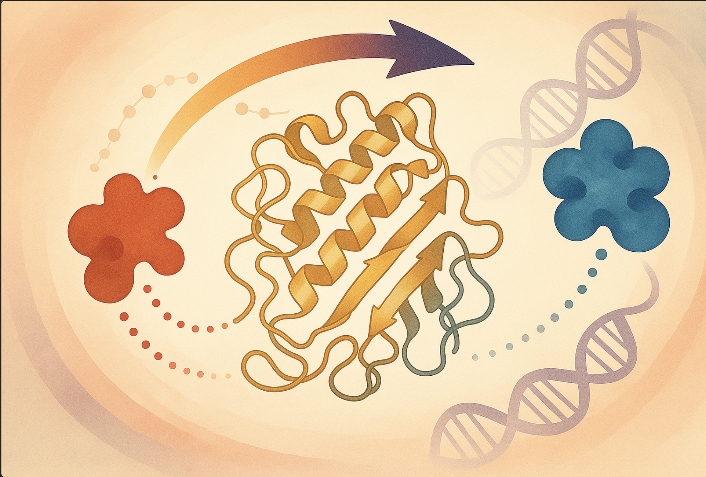

# Phage-assisted evolution of allosteric protein switches

## Abstract
Allostery, the transmission of locally induced conformational changes to distant functional sites, is a key mechanism for protein regulation. Artificial allosteric effectors enable remote manipulation of cell function; their engineering, however, is hampered by our limited understanding of allosteric residue networks. Here, we introduce a phage-assisted evolution platform for in vivo optimization of allosteric proteins. It applies opposing selection pressures to enhance activity and switchability of phage-encoded effectors and leverages retron-based recombineering to broadly explore fitness landscapes, covering point mutations, insertions and deletions. Applying our pipeline to the transcription factor AraC yielded optogenetic variants with light-controlled activity spanning ~1000-fold dynamic range. Long-read sequencing across selection cycles revealed adaptive trajectories and corresponding allosteric interactions. Our work facilitates phage-assisted evolution of allosteric proteins for programmable cellular control.

For more details, please refer to our manuscript: [insert link here]

## Requirements
All analysis was conducted using Python version 3.9.1.

To use this repository, make sure you have conda or mamba installed on your device. Then run:
``` bash
conda env create -n pogo_pance --file environment.yml
```


## Data

The notebooks in `figure_notebooks` can be executed without the full raw dataset **unless explicitly stated otherwise** in the notebook header. For notebooks requiring original data, please download the corresponding datasets from Zenodo ([link]) and place the extracted contents into a folder named `data` at the root level of the repository.

⚠️ **Important:** Maintain the original Zenodo folder structure exactly. The expected directory tree should look like this:

<pre lang="markdown">
repo-root/
├── data/
│   ├── Flow_cytometry_raw_data/
│   ├── Illumina/
│   └── Nanopore/
│       ├── Nanopore_P0109/
│       └── Nanopore_P0115/
</pre>

### Illumina Data Overview

Each dataset includes a `config.json` file specifying parameters such as reference sequences, barcodes, and primer sequences. 

- Raw and processed data (including alignments) are located in the Zenodo repository at [insert link here]
- Analysis results (e.g. mutation enrichment, spectra, plots) are saved in `/final_output/Illumina/{experiment}`

**Naming conventions:**
- Each file includes its Barcode (BC) and Section (S) identifiers, e.g. `BC1_S1`
- Even single-barcode/section datasets use the labels `BC1` and `S1`
- `R1` = forward read, `R2` = reverse read  
  - In linker analysis: `R1` = left linker, `R2` = right linker  

#### Included Datasets

- **LOV_DP6_Library_Mutagenesis_10-8**  
  DP6 mutagenesis screen; analyzed for mutation enrichment and spectrum.

- **LOV_Linker_Library_Mutagenesis_10-8**  
  DMS library (RL8); targeted mutation rates and spectrum.

- **Linker_Library_Mutagenesis_10-8**  
  Linker library (RL1) analysis with indels.

- **RAMPhaGE_Plasmid_Library_NGS**  
  Input sequencing of retron libraries:  
  - `BC1`: linker library  
  - `BC2`: DMS (AraC-LOV2)  
  - Only forward reads used to avoid reverse read quality artifacts.

- **AraC-LOV_RAMPhaGE_Multi-library_NGS**  
  Combined DMS (BC1) and linker (BC2) analysis.

- **AraC-R2-LOV_POGO_RAMPhaGE_NGS**  
  Linker evolution experiment; two post-mutagenesis pools sequenced (BC2 and BC3).

### Nanopore Data Overview

All Nanopore datasets were processed using the same preprocessing pipeline. Basecalling was done with super high-accuracy settings; only reads with matching barcodes were used.

- Preprocessed reads are stored in the Zenodo repository at [insert link here]
- Results of the analysis are saved in `/final_output/Nanopore/Nanopore_{ID}/{barcode_name}`
- Raw data (super high-accuracy basecalling): in Zenodo repository at [insert link here]

#### Included Datasets

- **Nanopore_P0109**  
  Final-day sequencing of pools from different POGO setups:
  - **R2_P1-1_End - R2_P3-1_End**: aligned to **AraC-LOV2-R2**
  - **R5_P1-1_End - R5_P3-2_End**: aligned to **AraC-LOV2-R5**


- **Nanopore_P0115**  
  - **R2_P1-2_Cycle-1_P-1 - R2-LOV_P2_Pos_D\4**: aligned to **AraC-LOV2-R2**
  - **DMS_Library_Single_Passage**: aligned to **AraC-LOV2-WT** 
  - **Single_Retron_Edit_10-10**: single retron edit location

### Flow Cytometry Data

Flow cytometry data from FACS experiments were analyzed using the `cytoflow` package. Data can be found in the Zenodo repository at [insert link here]. The corresponding analysis and visualizations are documented in the notebooks `figure_notebooks/Figure_2.ipynb` and `figure_notebooks/Figure_S2.ipynb`.


## Usage
### Illumina Data Analysis

#### Required Input

1. A `config.json` file containing filtering and demultiplexing parameters located within each experiment folder.
2. `.fastq` files for forward (`R1`) and reverse (`R2`) reads.  
   **Filename format:**   `{variant}_{read direction}_001.fastq`  
   *Example:* `DP6_R1_001.fastq`

#### Automated Analysis Workflow

Run the following scripts sequentially to perform the analysis. Make sure to set the correct parameters for your analysis first. All scripts located at `analysis_pipeline/Illumina`

```bash
python 0_Illumina_preprocess_and_align_illumina_reads.py input_folder --save_ref

python 1_Illumina_analyze_mutation_enrichment.py
python 2_Illumina_analyze_linkers.py
```

For further analysis and visualisation, refer to the notebooks `3_Illumina_DMS_analysis.ipynb` and `4_Illumina_linker_analysis.ipynb` at `analysis_pipeline/Illumina`.

### Nanopore Data Analysis

Raw sequencing input data can be found in the Zenodo repository at [insert link here].

#### Sequencing & Basecalling

- Nanopore sequencing is performed using **MinION** with **Minknow** software.
- Use **super high-accuracy basecalling** and enable **barcode trimming**.
- Only keep reads where both ends have matching barcodes.

#### Read processing
Use the script below to perform all required preprocessing steps, including quality filtering, alignment, and quality control. Scripts located at `analysis_pipeline/Nanopore`.

```bash
bash 00_Nanopore_filtering_alignment_processing.sh
```
⚠️ **Important:** If you are analyzing linker variants, **do not** run the last step of the pipeline (script `04_Nanopore_process_reads.py`) (in-frame forcing).
Instead, skip this step and start from .bam files using: `2_Nanopore_linker_analysis.ipynb`

## PyMOL Structural Visualization

Positional enrichment data — derived from Nanopore-based variant frequency analysis — were mapped onto residue positions using a custom PyMOL coloring script.

The relevant scripts can be found in:
- `scripts/impose_enrichment_on_pymol.py` – for enrichment mapping
- `scripts/pymol/` – for individual `.pml` visualization files
